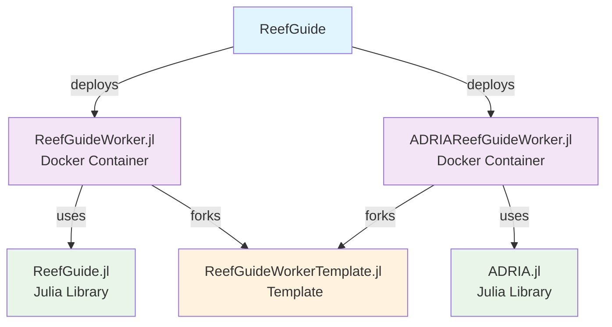

# ReefGuide

ReefGuide is a Reef decision support platform which integrates a collection of capabilities aimed to help Reef managers and researchers make informed decision about Reef intervention.

## View the [Docs](https://open-aims.github.io/reefguide)

## Site Selection (ReefGuide)

ReefGuide brings together multiple data layers to provide an ecologically informed site selection capability. Reef manager's and researchers can provide suitable boundaries for key ecological and bathymetric factors over the entire GBR, and see suggested deployment locations which maximise these factors on a high resolution map.

## ADRIA Analysis

ReefGuide is offering a new tool which exposes the power of ADRIA (Adaptive Dynamic Reef Intervention Algorithms) to a wider range of users, all from within an intuitive user interface, powered by compute in the cloud. ADRIA is a decision-support tool designed to help reef managers, modellers and decision-makers address the challenges of adapting to climate change in coral reefs.

Customise your model runs to understand comparative efficacy of intervention strategies in an assessment methodology aware of and robust to the deep uncertainties present in forecasted ecological modelling.

## Project structure

### Within this repository

This repository includes the following components

- ReefGuide frontend
- ReefGuide API and DB and associated schemas
- Infrastructure-as-code deployment for AWS
- ReefGuide supporting services including the asynchronous job system

### Related / dependent projects

This repository deploys components which are dockerised but highly tied to ReefGuide. These include

- [ReefGuideWorker.jl](https://github.com/open-AIMS/ReefGuideWorker.jl) - Julia Job Worker to run ReefGuide algorithms
- [ReefGuide.jl](https://github.com/open-AIMS/ReefGuide.jl) - ReefGuide Julia library code
- [ADRIAReefGuideWorker.jl](https://github.com/open-AIMS/ADRIAReefGuideWorker.jl) - Julia Job Worker to run ADRIA algorithms for ReefGuide
- [ADRIA.jl](https://github.com/open-AIMS/ADRIA.jl) - The ADRIA model Julia library code, used by ADRIAReefGuideWorker.jl
- [ReefGuideWorkerTemplate.jl](https://github.com/open-AIMS/ReefGuideWorkerTemplate.jl) - A foundational template to implement Julia workers

In most cases, these services (ReefGuideWorker.jl and ADRIAReefGuideWorker.jl) are deployed as Docker services from the GitHub container registry against the `latest` tag. The configuration for these containers is through

- environment variables (see `packages/infra`)
- EFS mounted data (each repository above documents where the data should be available) - see [managing efs data](docs/managing-efs-data.md) for more information on how to manage this data

### Repo relationships diagram

ReefGuide deploys `ReefGuideWorker.jl` and `ADRIAReefGuideWorker.jl` as Docker containers on ECS to consume jobs generated by users in the frontend. They each use their respective Julia library, and fork the template repository. Shown below.



## Development quick start

Make sure you have `nvm` and `docker` (rootless) installed, then run

```
./local-dev.sh
```

This will set the project up with reasonable defaults for a local dev.

To launch the web app, run:

```
pnpm run dev
```

This will launch the web app, defaulting to http://localhost:4200/.

Note that the workers have to be set up and launched before the web app becomes functional.
See the other ReefGuide repositories (see diagram above) and ensure locations for data files
and datapackages are suitably defined and correct.

Login credentials can be found inside the `.env` file under the
[web-api directory](./packages/web-api)

## Command-line tool

A commandline tool called `reefguide-cli` to aid in managing the database is also provided.

Inside `packages/cli`, run:

```
cp .env.dist .env
```

If pnpm is not configured globally, the `reefguide-cli` tool can be invoked under
`packages/cli` like so:

```
pnpm start <reefguide CLI arguments>

# For example

pnpm start --help
pnpm start data-spec reload
pnpm start cache --help
```

See the [`reefguide-cli` README](./packages/cli/README.md) for further detail and more
complete setup instructions.

## Manual setup

Use node e.g. v24

```
nvm install 24
nvm use 24
```

We are using pnpm, so make sure this is installed

```
npm i pnpm -g
```

## Installing dependencies

```
pnpm i
```

## Run turbo commands

You can now run turbo commands, for example:

using the installed turbo (in the workspace)

```
npx turbo <insert command here>
```

Or global install (using npm)

```
npm turbo -g
turbo <insert command here>
```

## Spinning up docker and minio

```
docker compose up -d
```

## Build

```
turbo build
```

## Dev

Make sure postgres and minio running with

```
docker compose up -d
```

If you are using the minio bucket, you will need to create the bucket. The `local-dev.sh` script does this for you.

Then

```
turbo dev
```

Again, the convenience setup script will handle all the above for you.

```
./local-dev.sh
```

## Format

```
turbo format:write
turbo format:check
```

## Linting and fixing

```
turbo lint
turbo fix
```

## Debugging

VSCode _launch.json_ has a few debugging configurations:

- "Debug app in Chrome" - launch Chrome and attach debugger
- "Debug web-api:dev" - launch node debugger targeting web-api `pnpm run dev`
  - Before launching, open a terminal and run: `pnpm run dev-no-web-api`

## Migrating production DB

See [migrating DBs](./docs/migrating-production-db.md).

## Uploading sourcemaps to BugSink

See [the bugsink docs](https://www.bugsink.com/blog/bugsink-1.5-introducing-sourcemaps/) for more info.

Setup the following environment variables:

- `SENTRY_URL`: the URL of the bugsink deployment e.g. `https://bugs.com.au/`
- `SENTRY_AUTH_TOKEN`: the auth token from your bugsink admin panel (you need to be the root user to generate these)

Then ensure you have installed

```
pnpm i
```

And run

```
pnpm exec turbo sourcemaps
```

This will build the typescript code, inject debug IDs, then upload source maps for the capacity manager and web API projects.
