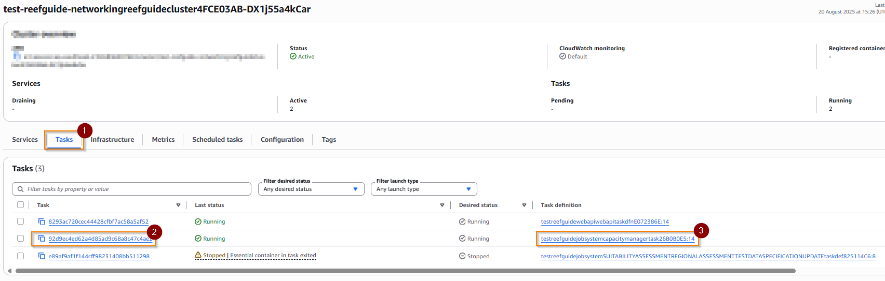
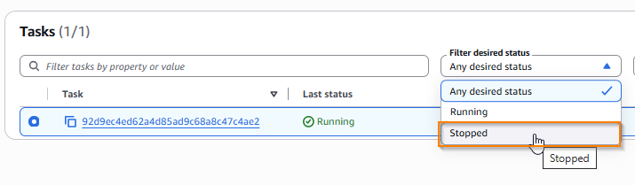
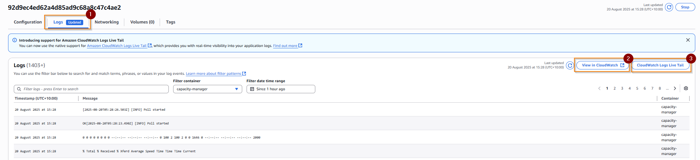
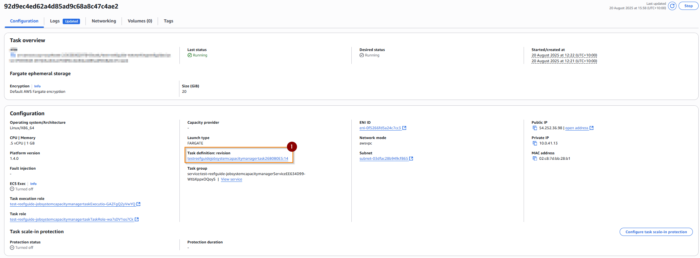
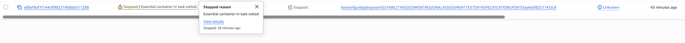
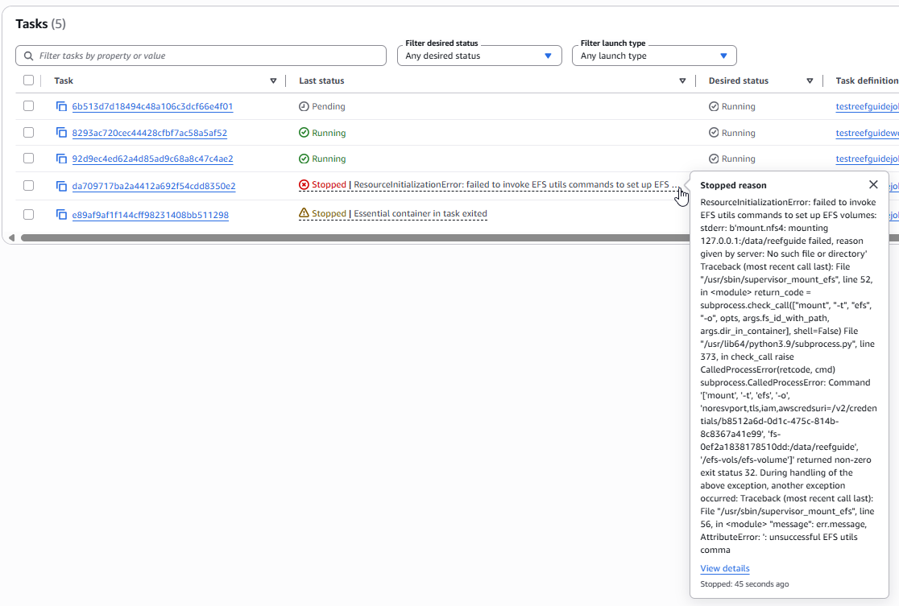
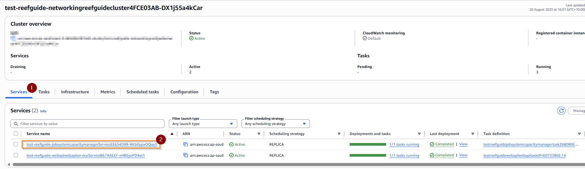
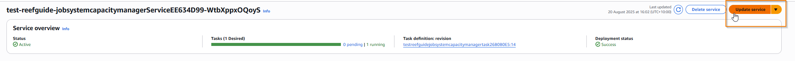
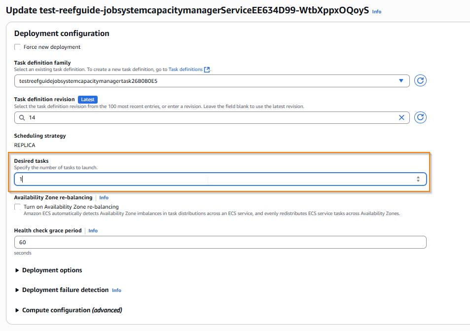

# Debugging ReefGuide

ReefGuide is deployed on AWS, and utilises a number of AWS services. Most of these services don't often encounter 'errors' i.e. Secrets Manager. Others can experience errors due to misconfiguration, runtime issues such as resource limitations, crashes etc. The below guide will explain how to access the logs, and common debugging tips, for the following components:

- web API (ECS Fargate)
- capacity manager (ECS Fargate)
- worker nodes i.e. ReefGuideWorker, ADRIAReefGuideWorker (ECS Fargate)

## ECS Background info

ECS has two capacity provider modes

- EC2
- Fargate

EC2 uses instances to provision capacity. This requires additional EC2 fleet management.

Fargate is the most abstracted option, hiding details around the instance hosting the containers from the system admin. ReefGuide exclusively uses Fargate for this reason.

There are some important ECS concepts to understand to help debug ECS container issues:

**VPC**: The VPC is the network in which the ECS Cluster is deployed

**Subnet/AZ**: The subnet (i.e. network grouping) and availability zone (physical server separation within an AWS region) in which the cluster is deployed. In most cases, we don't have to worry about this - we use a public subnet for our ECS nodes so that they have cost effective and simple outbound internet connectivity.

**Cluster**: An ECS cluster is a logical grouping of ECS services and tasks which are within one VPC

**Service**: A service is a long running collection of tasks. A service specifies the recommended number of running tasks, as well as auto scaling parameters.

**Task**: A task is defined by a task definition, and represents either a long running (in a service) or ephemeral (as in a standalone task) compute capacity, usually containing one or more containers

**Task Definition**: Defines the configuration for a task, including mounts, permissions, environment variables, containers etc.

**Container definition**: The configuration for a Docker container running within a task, includes additional details on mounts, variables, container images, etc.

**Volume mounts**: When configuring containers, volumes can be mounted. Elastic File System (EFS) is the only suitable option here, allowing multiple containers/tasks to share storage at defined locations. EFS volume mounts present frequent misconfiguration issues - see below [common EFS issues](#common-efs-issues).

**Task Role**: Tasks assume an IAM role when running - another common point of misconfiguration/errors is when the running ECS task is unable to perform the necessary operations due to insufficient permissions.

## Debugging ECS Services and tasks

Most debugging steps start with selecting the cluster and task of interest. This process is shown below.

### Selecting your cluster

To start with **all below processes require navigating to the ECS cluster in the AWS Console**.

In the AWS console, navigate to ECS, then Clusters.

Each ReefGuide deployment has one cluster - i.e. similar to `reefguide-networkingreefguidecluster...`. You may have a test deployment which may have a prefix e.g. `test-reefguide...`. Select the correct cluster.

### Selecting a task

From within the cluster page, choose the tasks tab (1), then click on a task (2), observing the Task definitions (3) as a hint at which kind of task it is, e.g. below we select the capacity manager task.

All tasks within the cluster are selectable from this tab - however, by default, it is filtered to only tasks which have a desired status of running, or which were killed within a certain period. To see a larger range of tasks (e.g. previously stopped), you can change the filter desired status option to show stopped containers.

### Debugging operations

There are a few common operations which can help debug tasks and services.

- [getting the logs for a running task or service](#getting-logs-for-running-task)
- [inspecting the task and container definitions for a service/task](#inspecting-task-and-container-definitions)
- [observing issues with task startup](#observing-task-startup-or-crash-failures)
- [seeing why a task ended/crashed](#observing-task-startup-or-crash-failures)

We also provide some discussion around common issues encountered administering/developing ECS services

- [issues with mounting EFS volumes](#common-efs-volume-mount-issues)
- [circuit breaking a cloudformation deployment loop](#circuit-breaking-a-cloudformation-deployment-loop)

### Getting logs for running tasks

First, select your cluster and task, as above.

From within a task, select the logs tab (1). This will give a subset of the logs - to view the full logs click on 'view in cloudwatch' (2) or to live tail use 'CloudWatch Logs live tail' (3) and then start it with the start button.

### Inspecting task and container definitions

First, select your cluster and task, as above.

You can then view the task definition by clicking on the task definition link (1) in the configuration section

This page details all information about the task, such as

- size (memory, CPU)
- container including environments, secrets, security and other configuration
- the revision of the task definition
- the IAM role it is using

and more.

Container definitions are part of the task definition, and are nested in expandable menus below the primary task definition.

### Observing task startup or crash failures

Sometimes, tasks (standalone or part of services) fail to startup.

The lifecycle of a task is documented [here](https://docs.aws.amazon.com/AmazonECS/latest/developerguide/task-lifecycle-explanation.html).

Often, when transitioning from provisioning -> pending -> running, startup issues are encountered.

You can see these by looking at the task list for the cluster, and looking for containers which show an error message.

Case 1: normal container shutdown due to container task finishing. You can see in the below that the reason provided indicates a running container exited. This could be a good or bad exit code, if you are concerned, consult the logs.

Case 2: abnormal failure for container to launch. In the below example, you can see a red Stopped status indicator, with a clickable explanation providing an error code. This particular error is due to an inability to mount the EFS volume since the necessary path does not exist on the EFS. See [common EFS issues](#common-efs-volume-mount-issues).

In conclusion - tasks can a) fail to startup due to misconfigurations for many reasons or b) crash and exit abnormally c) exit normally. This method can help diagnose them. If you are uncertain about an exit condition [check the logs](#getting-logs-for-running-tasks).

**If you cannot get a container to start, and it is repeatedly failing, you may need to circuit break the deployment, especially during CDK deployments - see [circuit breaking](#circuit-breaking-a-cloudformation-deployment-loop)**.

### Common EFS volume mount issues

The mounting of EFS to ECS is a fragile system. You need to

- ensure the ECS container has IAM permissions to use the EFS
- ensure the ECS container security group has a reachable and whitelisted network path on the right ports to the EFS security group
- ensure the mount path on the EFS and the container are correct
- ensure the mount path on the EFS exists prior to the container starting

For example, AWS will not automatically create a file structure for you - you will need to bootstrap the EFS with the correct folder structure. To do so, see [managing EFS data](./managing-efs-data.md).

Since the CDK configuration automates almost all of the nitty-gritty setup, we are left with the final point - ensuring the EFS file structure is correct. If it's not, you will see an issue like the below:

This obtuse error message is indicating that the EFS utils could not mount the file system - in this case because the mount target doesn't exist.

So, **ensure that the mount target exists in the EFS, even if it is an empty folder, in this case being `/data/reefguide`**. So when following [managing EFS data](./managing-efs-data.md), ensure that `~/efs/data/reefguide` exists.

### Circuit breaking a cloudformation deployment loop

Cloudformation, while useful, can get stuck in certain conditions. The most common of these conditions I have seen is where an ECS service fails to update for a _long_ time because one of the services cannot successfully launch the new version of the task(s).

You will see a 'stuck' deployment on the "UPDATE_IN_PROGRESS" state on the ECS service.

Unfortunately, you have few options here. You can

a) wait a few hours for it to timeout, for it to roll back
b) try and force a rollback, but this is often problematic
c) delete the stack

There is however a hack to overcome this - you need to let the service _think_ it's completed the deployment. The easiest way to do this, is to **set the desired number of tasks in the service to 0**.

First, navigate to the cluster (as above), then instead of choosing a task directly, select a _service_, e.g. below we choose the capacity manage. Go to the services tab (1) and choose the service (2).

In the top right, select 'update service'

And set desired tasks to 0:

And confirm this change with the update button at the bottom right of the form.

You should now see that things resolve - you can then redeploy the system with the required fixes, and try again. The desired capacity will usually update itself back to the original value upon this deployment, but if not, you can manually adjust it back using the procedure above.

**If the service has autoscaling enabled, the desired capacity can change on the fly, however this hack will usually remain stable long enough to let CloudFormation see a complete deployment - if not, just keep forcing it back to zero until it succeeds**.
