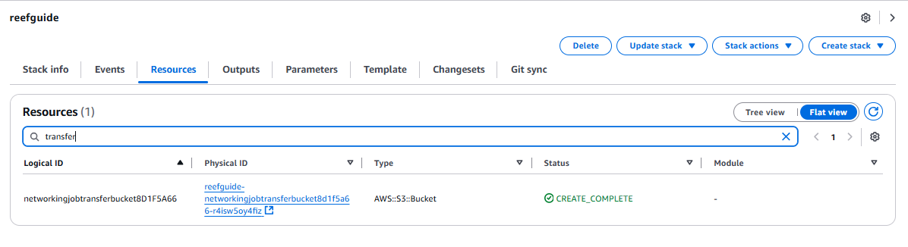
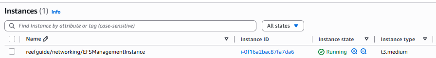

# Managing EFS Data for AWS deployment

The job system uses elastic file system (EFS) which is Amazon's solution for network mounted file systems.

This allows nodes in the ECS Fargate deployments to share files seamlessly so long as they are volume mounted into the docker containers at runtime.

## Current uses

- data files for ReefGuideWorker.jl (i.e. critiera layers, reef data)
- data packages for ADRIAReefGuideWorker.jl (data packages)

## How to manage data in the EFS file store

Firstly, there is no obvious way to move data from your local system to EFS directly - instead you use an S3 bucket as a middle-man storage.

So...

### Upload data to S3

Whatever data you want to put onto the EFS system, upload it to the deployed S3 transfer bucket.

This is created in the below code as part of reefguide infra:

```typescript
// Create S3 Bucket - setup to be transient
this.dataBucket = new s3.Bucket(this, 'job-transfer-bucket', {
  versioned: false,
  encryption: s3.BucketEncryption.S3_MANAGED,
  removalPolicy: RemovalPolicy.RETAIN,
  autoDeleteObjects: false
});
```

So in your cloudformation stack, look for this bucket e.g.



You can navigate to the bucket using the physical ID link above, and then upload objects into the bucket using the S3 interface. 

### Connect to management EC2 instance

As part of the ReefGuide stack, an EC2 instance is deployed which has the correct networking and security configuration to enable RW into the EFS instance.

Navigate to EC2, and click on the service instance: 



Then click the connect button in top right and connect using session manager. 

### Mounting the EFS

Once connected, run

```bash
sudo su - ubuntu
./mountefs.sh 
```

This should mount up the EFS to `~/efs`.

You can then place the data files into the correct location/modify things as needed.

### Downloading data from S3 to service instance

You can use the AWS CLI which is installed on the service instance to download files from s3, for example I am downloading a data package for the `ADRIAReefGuideWorker.jl` service.


See [aws s3 CLI](https://docs.aws.amazon.com/cli/latest/reference/s3/#synopsis) for more commands. 

For example: 

```bash
mkdir downloads
cd downloads
aws s3 sync s3://bucket-name/path .
```

### Managing data

You can use the ranger file CLI utility for moving data - see [docs](https://github.com/ranger/ranger/wiki/Official-User-Guide) - launchable with `ranger` in the terminal directly. Or you can use regular shell commands. 

## Tidying up

Once finished, don't leave superfluous data on the EFS store, as this is charged per GBhour. Additionally, shutdown (but don't terminate) i.e. 'stop' the EC2 management instance. It can just be started up again next time it is needed.
