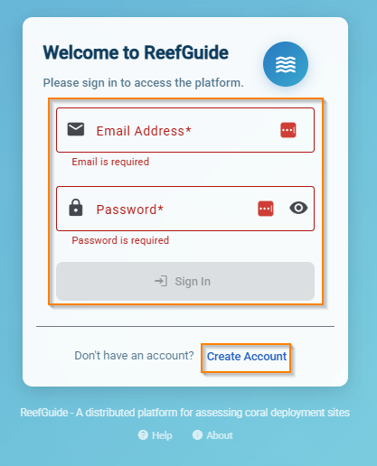
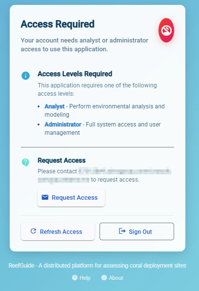

## User Roles

ReefGuide has three user roles:

- **ADMIN**: Full system access including administrative functions and job management
- **ANALYST**: Standard user access to launch jobs and view results
- **DEFAULT**: No system access (placeholder for future use)

New users who register themselves receive no roles initially and cannot access the system until an admin grants them appropriate permissions.

## Getting Users Into the System

### Self Registration

Users can create their own accounts by visiting the login page and clicking "Register". After registration, they see a message explaining they need to contact an administrator for access permissions.





### Admin Creates User Directly

Administrators can create user accounts through the web interface:

1. Log into ReefGuide
2. Click profile icon (top right) → Manage Users → Add User
3. Enter email, password, and assign roles

### Pre-Authorization (Recommended)

Pre-authorization allows admins to set up user permissions before the user registers. When the user eventually creates their account, they automatically receive the pre-assigned roles.

This approach lets users set their own passwords while ensuring they get the right permissions immediately upon registration.

## Managing User Roles

### Web Interface (Simple Changes)

For individual users or small changes:

1. Log into ReefGuide → Profile icon → Manage Users
2. Find the user in the list
3. Click the three dots menu → Edit Roles
4. Select or deselect roles as needed

### Command Line Interface (Bulk Changes)

For multiple users or complex operations, use the CLI tools. First, [set up the CLI](./setting-up-reefguide-cli.md).

#### Single User Changes

```bash
# Give someone admin access
pnpm start preapproval add-users "user@example.com:ADMIN"

# Give multiple roles
pnpm start preapproval add-users "user@example.com:ADMIN,ANALYST"
```

#### Bulk User Changes

Create a CSV file with this format:

```csv
email,roles
user1@company.com,ADMIN;ANALYST
user2@company.com,ANALYST
newuser@company.com,ADMIN
```

Then import it:

```bash
pnpm start preapproval add-users-bulk users.csv
```

#### Export Current Users

Generate a CSV of all current users (useful for bulk editing):

```bash
# Basic export
pnpm start user-audit export users.csv

# Include pending pre-approvals
pnpm start user-audit export users-full.csv --include-pre-approvals
```

**Workflow tip**: Export users, edit the CSV in Excel, then import the changes back.

#### View Pre-Approvals

```bash
# See all pre-approvals
pnpm start preapproval list

# See only unused pre-approvals
pnpm start preapproval list --used false
```

## How Role Changes Work

**Adding roles**: The CLI only adds roles, never removes them. If someone has ANALYST and you give them ADMIN, they end up with both roles.

**Removing roles**: Use the web interface to remove roles from users.

**Existing vs new users**: 
- Existing users get role changes immediately
- New users get pre-approvals that activate when they register

## Password Management

### Admin Changes User Password

1. Log into ReefGuide → Profile icon → Manage Users
2. Find the user → three dots menu → Change Password
3. Enter the new password

### User Changes Own Password

This feature is not yet implemented. Users currently need to contact administrators for password changes.

## Common Workflows

**New employee starting**:
```bash
# Set up access before they register
pnpm start preapproval add-users "newemployee@company.com:ANALYST"
```

**Promote multiple users to admin**:
```bash
pnpm start preapproval add-users "user1@company.com:ADMIN" "user2@company.com:ADMIN"
```

**Monthly user review**:
```bash
# Export all users for review
pnpm start user-audit export "user-audit-$(date +%Y-%m).csv" --include-pre-approvals
```

**Bulk role updates**:
1. Export current users: `pnpm start user-audit export current-users.csv`
2. Edit the CSV file with desired changes
3. Import changes: `pnpm start preapproval add-users-bulk current-users.csv`
